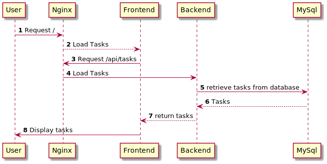

Tasks 
===

This is a sample application that provides with a *VERY* simple task management tool, just adding and deleting Tasks.

It's built on top of a [Vue.js](https://vuejs.org) frontend application , a [Dropwizard](https://dropwizard.io) backend application, and a [MySql](https://mysql.com) database engine.

In order to handle the routing between the frontend application and the backend, there's an [nginx](https://nginx.org) web server that will route traffic between them, as the following diagram shows :

Whenever a new request comes in, it's dispatched to the frontend application if request is for _/_, and to backend if it's to _/api/*_

Now, let's dissect the different parts of the solution

## Applications

### FrontEnd application

This a  [Vue.js](https://vuejs.org) made just for the purpose of having something 'visible' for the backend real application.
Take care the behaviour is not as good as it should be, as my vuejs knowledge is far from good, so , currently, you have to refresh the page in order to see newly created tasks so as deleted tasks.

### Backend application

This is the main [REST](https://en.wikipedia.org/wiki/Representational_state_transfer) application.

It's done using the [Dropwizard](https://dropwizard.io) framework, following the [Model-View-Controller pattern](https://en.wikipedia.org/wiki/Model%E2%80%93view%E2%80%93controller).

The main 

### MySql database

This is a simple docker image run with the following command:
`docker run --name some-mysql -p 3306:3306 -e MYSQL_DATABASE=tasks 
-e MYSQL_USER=tasks 
-e MYSQL_PASSWORD=tasks 
-e MYSQL_ALLOW_EMPTY_PASSWORD=true 
mysql:8`

With this command, you will pre-create a *tasks* schema, with a *tasks* user and *tasks* password with permissions to r/w on that given *tasks* schema.

## How to run

1. You need [docker](https://docker.io) and [docker-compose](https://docs.docker.com/compose/) in order to run the application.
2. Once all those tools are installed, it's as easy as running `docker-compose up -d` to have it available. 
3. After 1 minute, you can just go to [Tasks](http://localhost:9090) to display the Tasks home page

